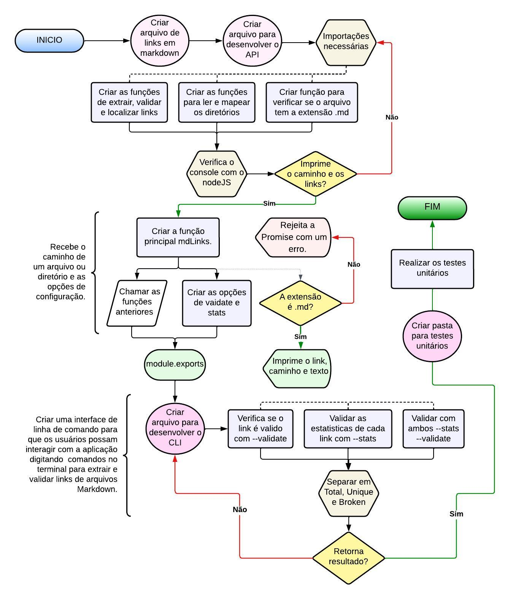

# Markdown Links

## Índice

* [1. Prefácio](#1-prefácio)
* [2. Guia de instalação e uso](#2-Guia-de-instalação-e-uso)
* [3. Fluxograma](#3-Fluxograma)
* [4. Tecnologias Utilizadas](#4-Tecnologias-Utilizadas)

***

## 1. Prefácio 👾
Markdown é uma linguagem de marcação amplamente utilizada por programadores em diversas plataformas, como GitHub, fóruns, blogs, entre outros. É comum encontrar arquivos com formato .md em praticamente todos os repositórios, especialmente no tradicional README.md.

O objetivo deste projeto é desenvolver uma biblioteca que permita a leitura de arquivos Markdown por meio de uma CLI (Interface de Linha de Comando), facilitando a execução da biblioteca diretamente no terminal, através de um módulo Node.js. Essa biblioteca terá a funcionalidade de ler arquivos com a extensão .md, verificar a existência de links e coletar estatísticas relacionadas a eles.

## 2. Guia de instalação e uso ✅

Para instalar a biblioteca, abra o terminal e digite o seguinte comando: npm install md-links-caroline-vaz

Após a instalação bem-sucedida, verifique se você possui um arquivo com a extensão .md contendo links dentro dele.

# 1. Opção para obter os caminhos, textos e links do arquivo selecionado:

Para visualizar os caminhos, textos e links do arquivo, execute o comando: 
md-links <caminho-do-arquivo>
Exemplo:
md-links arquivo.md

.png)

# 2. Opção para validar os links do arquivo: 📂

Para validar os links do arquivo com requisições HTTP, utilize a propriedade --validate.
Comando:
md-links <caminho-do-arquivo> --validate
Exemplo:
md-links arquivo.md --validate

.png)

# 3. Opção para verificar as estatísticas dos links do arquivo: 📂

Para verificar as estatísticas dos links do arquivo, utilize a propriedade --stats.
Comando:
md-links <caminho-do-arquivo> --stats
Exemplo:
md-links arquivo.md --stats

.png)

# 4. Opção para verificar estatísticas e validar os links do arquivo: 📂

Para obter estatísticas e validar os links do arquivo, utilize a propriedade --validate --stats.
Comando:
md-links <caminho-do-arquivo> --validate --stats
Exemplo:
md-links arquivo.md --validate --stats

.png)

## 3. Fluxograma 📈

## 4. Tecnologias Utilizadas 💻

